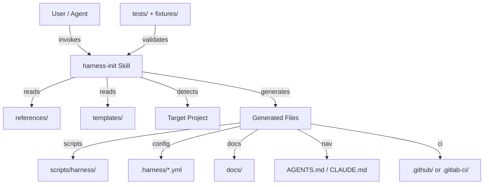
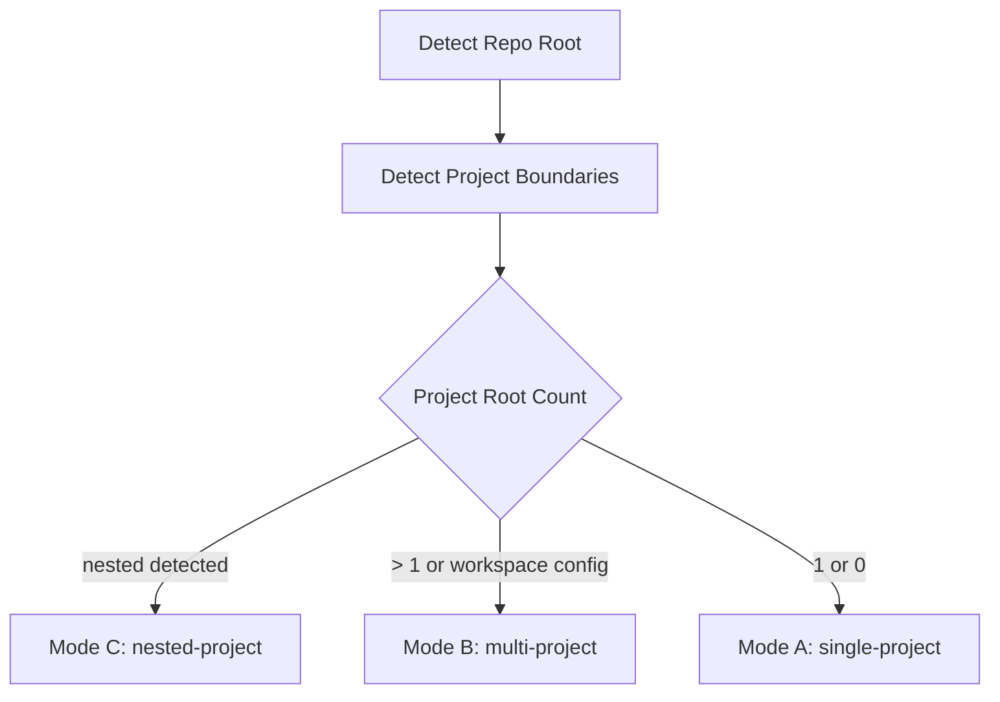
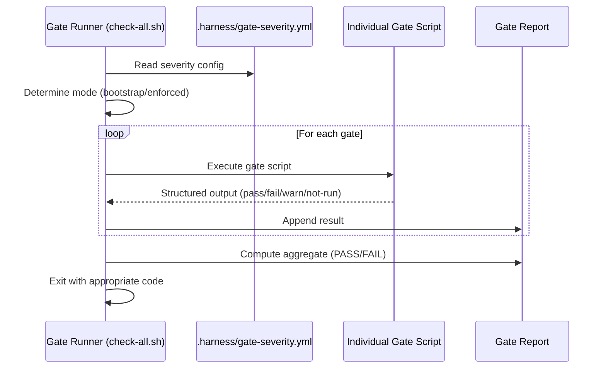
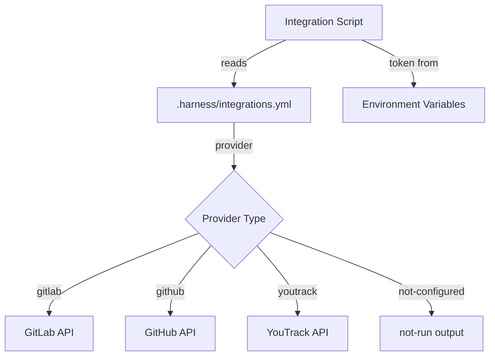

# Design Document: harness-init v4 Upgrade

## Overview

This design describes the upgrade of `harness-init` from v3 to v4, transforming it from an "advanced engineering governance Skill" into an "agent-drivable engineering operating system initializer." The upgrade is incremental — preserving all v3 structures while adding self-testing infrastructure, agent-readable runtime, deep observability, quality scoring, context snapshots, subagent workflows, external integrations, and security boundaries.

The Skill generates shell scripts (bash + PowerShell), YAML configurations, and markdown documents into target projects. It does not produce application code — it produces project infrastructure that enables agents to autonomously operate within engineering constraints.

### Key Design Decisions

1. **Template-driven generation**: All output files originate from `templates/` directory, rendered with project-specific values from detection and configuration.
2. **Dual-shell architecture**: Every critical script has a bash canonical version and a PowerShell degraded-mode counterpart.
3. **Configuration-over-convention**: `.harness/*.yml` files drive all runtime behavior; scripts read config rather than hardcoding assumptions.
4. **Structured gate output**: All gates produce machine-parseable FAIL/Reason/Evidence/Fix/Docs/Bypass blocks.
5. **Layered scoring**: Quality score is computed from file existence checks, gate results, and configuration completeness — never from unchecked assumptions.

## Architecture

### System Context



### Execution Pipeline


### Mode Detection Flow



### Script Shared Functions Architecture

All bash scripts source a common library for consistent behavior:

```
scripts/harness/
├── _lib.sh                    # Shared functions (sourced by all scripts)
├── check-all.sh               # Gate aggregator
├── check-critical.sh          # Minimal blocking gates
├── score-quality.sh           # Scorecard calculator
├── update-context-snapshot.sh # Snapshot generator
├── worktree-create.sh         # Worktree management
└── ...

scripts/harness-pwsh/
├── _lib.ps1                   # Shared PowerShell functions
├── self-test.ps1
├── score-quality.ps1
└── ...
```

#### `_lib.sh` Common Functions

```bash
#!/usr/bin/env bash
# Shared library for harness scripts - sourced, not executed directly

# --- Output Formatting ---
harness_pass()    { echo "pass: $1"; }
harness_fail()    { echo "FAIL: $1"; echo "Reason: $2"; echo "Evidence: $3"; echo "Fix: $4"; echo "Docs: $5"; echo "Bypass: $6"; }
harness_warn()    { echo "warn: $1"; }
harness_notrun()  { echo "not-run: $1"; echo "Command: $2"; echo "Reason: $3"; echo "Risk: $4"; }

# --- Config Reading ---
harness_read_yml() { ... }  # Read YAML value using python/yq/grep fallback
harness_config_dir() { ... }  # Locate .harness/ directory

# --- Environment Detection ---
harness_detect_mode() { ... }  # Returns bootstrap|enforced
harness_detect_scope() { ... }  # Returns root|project|nested-project
harness_check_cmd() { command -v "$1" >/dev/null 2>&1; }

# --- Path Safety ---
harness_assert_in_worktrees() { ... }  # Validates path is under .worktrees/
harness_assert_canonical() { ... }  # Validates path is canonical, not legacy
```

## Components and Interfaces

### 1. Template Engine (Conceptual)

The Skill itself acts as the template engine — the agent reads templates from `templates/` and renders them into the target project based on detected context.

**Interface:**
- Input: Template file path, project context (mode, stack, scope)
- Output: Rendered file content with `TODO: 待补充` for unknown values
- Constraint: Never output `<...>` placeholders; always `TODO: 待补充`

### 2. Gate Execution Pipeline



**Gate Output Contract:**
```
FAIL: <gate-name>
Reason: <why failed>
Evidence: <file:line or command output>
Fix: <concrete remediation steps>
Docs: <canonical doc path>
Bypass: <ADR exception path if allowed, otherwise "not allowed">
```

### 3. Scorecard Calculator

**Interface:**
- Input: `.harness/scorecard.yml` (weights + thresholds), file system state, gate results
- Output: Score breakdown (7 dimensions), total score, mode recommendation, autonomy recommendation, blocking issues, next actions
- Algorithm: See Data Models section for scoring rules

### 4. Context Snapshot Generator

**Interface:**
- Input: `docs/exec-plans/active/`, `docs/exec-plans/completed/`, `tech-debt-tracker.md`, `docs/decisions/ADR-exceptions/`, `.harness/scorecard.yml`, `.harness/autonomy.yml`
- Output: `docs/harness/context-snapshot.md` with structured sections

### 5. Worktree Sandbox Manager

**Interface:**
- `worktree-create.sh <task-id> <branch>` → Creates `.worktrees/harness-<task-id>`
- `worktree-run.sh <task-id> <command>` → Executes in worktree, captures output
- `worktree-clean.sh [--force]` → Removes worktree (with safety checks)
- `worktree-status.sh` → Lists active worktrees and their state

### 6. Fixture Test Framework

**Interface:**
- `tests/run-fixtures.sh` → Orchestrates all fixture tests
- `tests/assert-*.sh` → Individual assertion scripts
- `tests/golden/` → Baseline comparison files

**Execution Flow:**
```
For each fixture in fixtures/*:
  1. Copy fixture to temp dir
  2. Run harness-init dry-run → capture plan
  3. Run harness-init init → capture first-run output
  4. Run harness-init init again → capture second-run output
  5. Run assert-idempotent (compare first vs second)
  6. Run assert-root-nav-clean
  7. Run assert-placeholder-gate
  8. Run assert-golden (compare vs golden/)
  9. Report pass/fail per fixture
```

### 7. Integration Abstraction Layer



**Contract:** Every integration script:
1. Reads `.harness/integrations.yml` for provider config
2. Checks token env var existence
3. If missing → outputs `not-run` with specific missing config
4. If present → executes API call
5. Outputs structured result

### 8. Subagent Workflow Router

**Interface:**
- Input: Changed file paths, PR labels, workflow trigger type
- Config: `subagents/routing-rules.yml`
- Output: Required roles list, blocking status, workflow to execute

### 9. v2→v3 Migration Detector

**Interface:**
- Input: File content containing marker blocks
- Detection: Regex for `Harness Init Contract Version: v2`
- Output: List of migration candidates with location, suggested replacement, and risk

## Data Models

### Configuration Schema: `.harness/runtime.yml`

```yaml
version: 1
runtime:
  dev:
    command: "npm run dev"          # or "TODO: 待补充"
    url: "http://localhost:3000"    # or "TODO: 待补充"
    health_check: "curl -sf http://localhost:3000/health"
  checks:
    lint: "npm run lint"
    test: "npm test"
    typecheck: "npx tsc --noEmit"
    build: "npm run build"
  logs:
    local_path: "logs/"
  ui:
    provider: "not-configured"     # playwright | chrome-devtools-mcp | not-configured
    base_url: "TODO: 待补充"
```

### Configuration Schema: `.harness/scorecard.yml`

```yaml
version: 1
thresholds:
  bootstrap_min: 60
  enforced_min: 80
  autonomy_l3_min: 85
  autonomy_l4_min: 92
weights:
  context_readability: 20
  plan_discipline: 15
  architecture_enforcement: 20
  test_confidence: 15
  observability_surface: 15
  entropy_control: 10
  autonomy_readiness: 5
```

### Configuration Schema: `.harness/integrations.yml`

```yaml
version: 1
code_host:
  provider: gitlab               # gitlab | github | not-configured
  base_url: "TODO: 待补充"
  token_env: GITLAB_TOKEN
  merge_request_required: true
  plan_link_required: true
issue_tracker:
  provider: youtrack             # youtrack | jira | linear | not-configured
  base_url: "TODO: 待补充"
  token_env: YOUTRACK_TOKEN
  required_for_plan: false
mcp:
  enabled: false
  servers:
    browser:
      provider: "TODO: 待补充"
      approval_required_for:
        - delete
        - production-deploy
        - permission-change
        - database-migration
        - secret-rotation
        - force-push
```

### Configuration Schema: `.harness/observability.yml`

```yaml
version: 1
logs:
  provider: file                 # file | loki | victoria-logs | elastic | not-configured
  local_path: "logs/"
  endpoint_env: LOGS_ENDPOINT
metrics:
  provider: not-configured       # prometheus | victoria-metrics | not-configured
  endpoint_env: METRICS_ENDPOINT
traces:
  provider: not-configured       # tempo | jaeger | otel | not-configured
  endpoint_env: TRACES_ENDPOINT
slo:
  availability: "TODO: 待补充"
  latency_p95: "TODO: 待补充"
  error_rate: "TODO: 待补充"
```

### Configuration Schema: `.harness/gates.yml`

```yaml
version: 1
mode: bootstrap                  # bootstrap | enforced
gates:
  plan-required:
    severity: blocking
    script: scripts/harness/check-plan-required.sh
    skip_on: [push]              # Only run on PR events
  architecture-boundary:
    severity: blocking
    script: scripts/harness/check-boundaries.sh
  alias-integrity:
    severity: blocking
    script: scripts/harness/check-alias-integrity.sh
  wrapper-integrity:
    severity: blocking
    script: scripts/harness/check-wrapper-integrity.sh
  placeholder-angle:
    severity: blocking
    script: scripts/harness/check-placeholders.sh
  secrets:
    severity: blocking
    script: scripts/harness/check-secrets.sh
  permissions:
    severity: blocking
    script: scripts/harness/check-permissions.sh
  runtime-surface:
    severity: warning
    script: scripts/harness/check-runtime-surface.sh
  scorecard:
    severity: warning
    script: scripts/harness/score-quality.sh
  context-snapshot:
    severity: warning
    script: scripts/harness/check-context-snapshot.sh
```

### Configuration Schema: `subagents/routing-rules.yml`

```yaml
version: 1
routes:
  - when:
      changed_paths:
        - "apps/editor/**"
        - "packages/components/**"
    require_roles:
      - editor-component
      - quality-gate
    blocking: false
  - when:
      changed_paths:
        - "packages/runtime/**"
        - "packages/schema/**"
    require_roles:
      - runtime-dataflow
      - architect
      - quality-gate
    blocking: false
  - when:
      labels:
        - security
        - auth
        - data-migration
    require_roles:
      - architect
      - quality-gate
      - governance-context
    blocking: true
```

### Scorecard Calculation Algorithm

```
For each dimension D in [context_readability, plan_discipline, ...]:
  max_score = weights[D]
  checks = dimension_checks[D]  # list of check items
  passed = count(checks where status == pass)
  total = count(checks)
  
  # Deductions
  deduction = 0
  for check in checks:
    if check.status == "fail":
      deduction += check.weight
    elif check.status == "not-run":
      deduction += check.weight * 0.5  # Partial deduction for unknown state
    elif check.status == "warn":
      deduction += check.weight * 0.25
  
  dimension_score = max(0, max_score - deduction)

total_score = sum(all dimension_scores)

mode_recommendation:
  if total_score >= thresholds.enforced_min: "enforced"
  elif total_score >= thresholds.bootstrap_min: "bootstrap"
  else: "not ready"

autonomy_recommendation:
  if total_score >= thresholds.autonomy_l4_min: "L4"
  elif total_score >= thresholds.autonomy_l3_min: "L3"
  elif total_score >= thresholds.enforced_min: "L2"
  else: "L1"
```

### Dimension Check Items

| Dimension | Check Items |
|---|---|
| context_readability (20) | Navigation file exists (4), Navigation < 200 lines (3), docs/ discoverable (4), context-snapshot exists (5), runtime-surface documented (4) |
| plan_discipline (15) | exec-plans/active/ exists (3), tech-debt-tracker exists (3), plans have Status field (3), PR links plan (3), blocked plans documented (3) |
| architecture_enforcement (20) | architecture-boundaries.md exists (4), check-boundaries.sh exists (4), boundary gate passes (6), no forbidden imports (6) |
| test_confidence (15) | test command configured (3), tests pass (4), fixtures exist (3), golden tests pass (3), CI runs tests (2) |
| observability_surface (15) | observability.yml exists (3), query-logs works (3), query-metrics works (3), UI verification configured (3), health check works (3) |
| entropy_control (10) | entropy-gc.md exists (2), doc-gardening configured (3), no expired ADR exceptions (3), drift detection active (2) |
| autonomy_readiness (5) | autonomy.yml exists (1), agent-autonomy.md exists (1), L2+ criteria met (2), approval workflows defined (1) |

### Gate Output Data Structure

```
GateResult:
  name: string
  status: "pass" | "fail" | "warn" | "not-run"
  # Only present when status == "fail":
  reason?: string
  evidence?: string        # file:line or command output
  fix?: string             # concrete remediation steps
  docs?: string            # canonical doc path
  bypass?: string          # ADR exception path or "not allowed"
  # Only present when status == "not-run":
  command?: string         # what was supposed to run
  not_run_reason?: string  # why it didn't run
  residual_risk?: string   # what risk remains
```

### v2→v3 Migration Detection Pattern

```
MarkerBlock:
  version: "v2" | "v3"
  generator: "harness-init"
  scope: "root" | "project" | "nested-project"
  content_hash: string     # For idempotency detection
  
MigrationCandidate:
  file_path: string
  line_start: number
  line_end: number
  current_version: "v2"
  suggested_action: "keep" | "migrate" | "remove"
  migration_steps: string[]
  risk: string
  conflicts_with: string[]  # v3 blocks that overlap
```

### Directory Structure (Skill Project)

```
harness-init/
├── SKILL.md                          # Main skill definition (v4.0.0)
├── references/                       # Reference docs (loaded on demand)
│   ├── stack-detection.md
│   ├── nav-templates.md
│   ├── docs-templates.md
│   ├── tooling-templates.md
│   ├── structure-tests.md
│   ├── exec-plan-templates.md
│   ├── ci-governance.md
│   ├── quality-gates.md
│   ├── agent-autonomy.md
│   ├── observability-templates.md
│   ├── gc-templates.md
│   ├── runtime-preflight.md
│   ├── report-templates.md
│   ├── repair-mode.md
│   ├── regression-fixtures.md
│   ├── runtime-surface.md            # NEW v4
│   ├── worktree-sandbox.md           # NEW v4
│   ├── ui-verification.md            # NEW v4
│   ├── observability-runtime.md      # NEW v4
│   ├── scorecard-templates.md        # NEW v4
│   ├── context-snapshot.md           # NEW v4
│   ├── mcp-integrations.md           # NEW v4
│   ├── subagent-workflows.md         # NEW v4
│   ├── security-templates.md         # NEW v4
│   └── permission-boundaries.md      # NEW v4
├── fixtures/                          # NEW v4 - Test fixtures
│   ├── single-node-ts/
│   ├── pnpm-monorepo/
│   ├── nested-project/
│   ├── polluted-root-nav/
│   ├── unknown-stack/
│   ├── existing-claude-only/
│   ├── legacy-docs-drift/
│   └── windows-no-bash/
├── tests/                             # NEW v4 - Self-tests
│   ├── run-fixtures.sh
│   ├── assert-idempotent.sh
│   ├── assert-root-nav-clean.sh
│   ├── assert-canonical-alias.sh
│   ├── assert-wrapper-integrity.sh
│   ├── assert-plan-gate.sh
│   ├── assert-placeholder-gate.sh
│   ├── assert-golden.sh
│   └── golden/
├── templates/                         # NEW v4 - Output templates
│   ├── scripts/harness/
│   │   ├── _lib.sh
│   │   ├── self-test.sh
│   │   ├── check-all.sh
│   │   ├── check-critical.sh
│   │   ├── score-quality.sh
│   │   ├── update-context-snapshot.sh
│   │   ├── worktree-create.sh
│   │   ├── worktree-run.sh
│   │   ├── worktree-clean.sh
│   │   ├── worktree-status.sh
│   │   ├── capture-dom.sh
│   │   ├── capture-screenshot.sh
│   │   ├── check-console.sh
│   │   ├── verify-user-journey.sh
│   │   ├── query-logs.sh
│   │   ├── query-metrics.sh
│   │   ├── query-traces.sh
│   │   ├── check-secrets.sh
│   │   ├── check-permissions.sh
│   │   ├── sync-issues.sh
│   │   ├── link-plan-to-issue.sh
│   │   ├── fetch-review-context.sh
│   │   └── create-merge-request.sh
│   ├── scripts/harness-pwsh/
│   │   ├── _lib.ps1
│   │   ├── self-test.ps1
│   │   ├── score-quality.ps1
│   │   ├── update-context-snapshot.ps1
│   │   ├── check-secrets.ps1
│   │   └── check-permissions.ps1
│   ├── .harness/
│   │   ├── runtime.yml
│   │   ├── scorecard.yml
│   │   ├── integrations.yml
│   │   ├── observability.yml
│   │   ├── autonomy.yml
│   │   ├── gates.yml
│   │   └── context-snapshot.yml
│   ├── .github/workflows/
│   │   └── harness.yml
│   └── gitlab-ci/
│       └── harness.gitlab-ci.yml
├── subagents/
│   ├── roles.json                    # Existing
│   ├── README.md                     # Existing
│   ├── routing-rules.yml             # NEW v4
│   ├── review-rubrics/               # NEW v4
│   │   ├── architect.md
│   │   ├── editor-component.md
│   │   ├── runtime-dataflow.md
│   │   ├── quality-gate.md
│   │   └── governance-context.md
│   └── workflows/                    # NEW v4
│       ├── feature-delivery.md
│       ├── bug-fix.md
│       ├── architecture-change.md
│       ├── schema-migration.md
│       └── release.md
└── scripts/harness/                  # Existing canonical scripts
```

### Target Project Generated Structure

```
target-project/
├── AGENTS.md (or CLAUDE.md)          # Navigation entry
├── .harness/
│   ├── runtime.yml
│   ├── scorecard.yml
│   ├── integrations.yml
│   ├── observability.yml
│   ├── autonomy.yml
│   ├── gates.yml
│   ├── gate-severity.yml
│   ├── plan-required-rules.yml
│   ├── artifacts/                    # Generated at runtime
│   │   ├── dom/
│   │   └── screenshots/
│   ├── runs/                         # Worktree run captures
│   └── user-journeys/               # UI journey definitions
├── docs/
│   ├── architecture-boundaries.md
│   ├── constraints.md
│   ├── testing.md
│   ├── ci-governance.md
│   ├── agent-autonomy.md
│   ├── observability.md
│   ├── feedback-loops.md
│   ├── entropy-gc.md
│   ├── runtime-surface.md            # NEW v4
│   ├── ui-verification.md            # NEW v4
│   ├── quality-score.md              # NEW v4
│   ├── security-threat-model.md      # NEW v4
│   ├── harness/
│   │   ├── harness-engineering.md
│   │   ├── context-snapshot.md       # NEW v4
│   │   └── doc-gardening-report.md
│   ├── integrations/                 # NEW v4
│   │   ├── gitlab.md
│   │   ├── youtrack.md
│   │   └── mcp.md
│   ├── exec-plans/
│   │   ├── active/
│   │   ├── completed/
│   │   └── tech-debt-tracker.md
│   ├── modules/
│   │   └── README.md
│   └── decisions/
│       ├── ADR-0001-harness-init.md
│       └── ADR-exceptions/
├── scripts/harness/                   # Generated scripts
│   ├── _lib.sh
│   ├── check-all.sh
│   ├── check-critical.sh
│   ├── score-quality.sh
│   ├── update-context-snapshot.sh
│   ├── worktree-create.sh
│   ├── worktree-run.sh
│   ├── worktree-clean.sh
│   ├── worktree-status.sh
│   ├── capture-dom.sh
│   ├── capture-screenshot.sh
│   ├── check-console.sh
│   ├── verify-user-journey.sh
│   ├── query-logs.sh
│   ├── query-metrics.sh
│   ├── query-traces.sh
│   ├── check-secrets.sh
│   ├── check-permissions.sh
│   ├── sync-issues.sh
│   ├── link-plan-to-issue.sh
│   ├── fetch-review-context.sh
│   └── create-merge-request.sh
└── scripts/harness-pwsh/              # PowerShell fallbacks
    ├── _lib.ps1
    ├── self-test.ps1
    ├── score-quality.ps1
    ├── update-context-snapshot.ps1
    ├── check-secrets.ps1
    └── check-permissions.ps1
```

